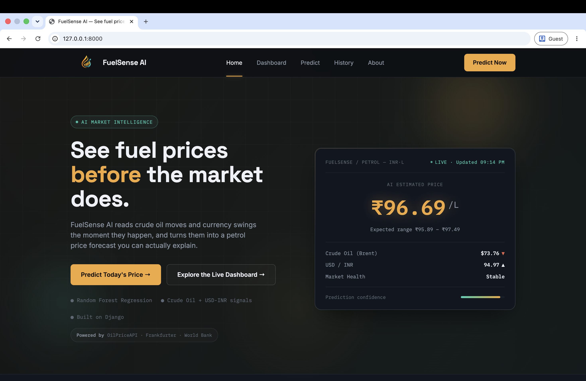
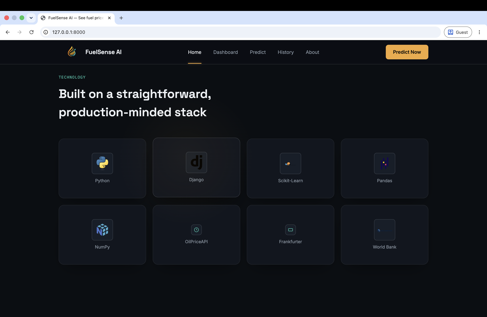
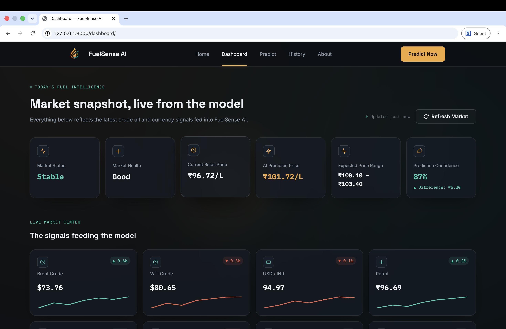
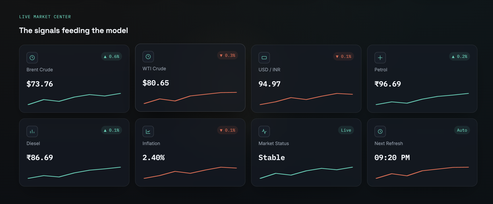
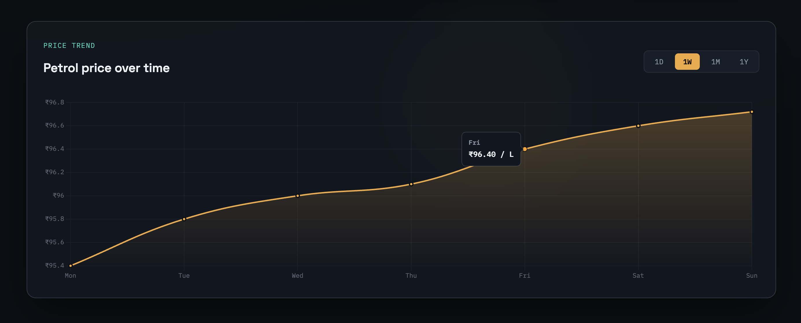
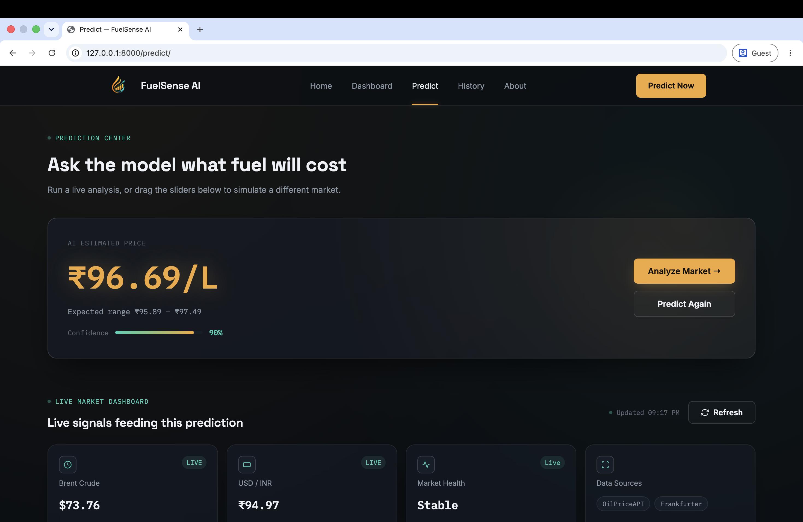
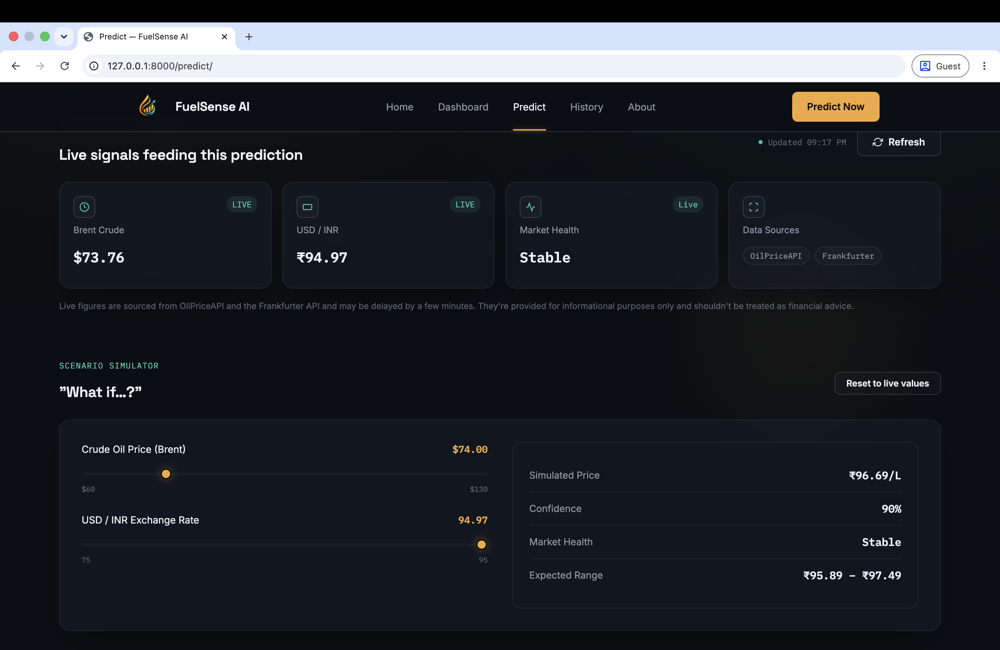
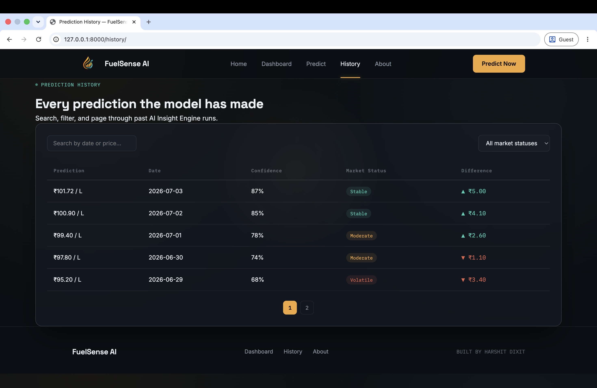
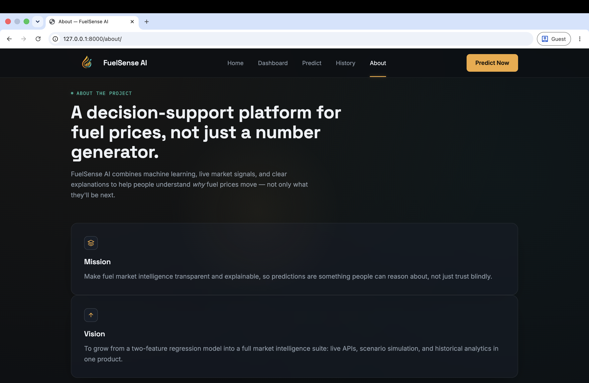
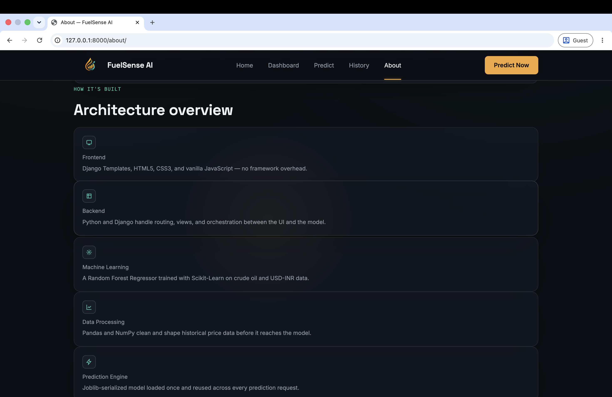

# ⛽ FuelSense AI

<p align="center">
AI-powered fuel price prediction platform built with <strong>Django</strong>, <strong>Machine Learning</strong>, and <strong>Live Market Data</strong>.
</p>

<p align="center">


</p>

---

# 📖 About

FuelSense AI is an AI-powered web application that predicts petrol prices using live market indicators such as Brent Crude Oil prices and the USD/INR exchange rate.

The project combines live market data, machine learning, and an intuitive dashboard to provide users with accurate fuel price predictions, confidence scores, expected price ranges, and market insights.

This project was built while learning **Data Science, Machine Learning, and Django**, with a focus on creating a clean, real-world web application.

---

# ✨ Features

- 📈 AI-powered petrol price prediction
- 🌍 Live Brent Crude Oil prices
- 💱 Live USD/INR exchange rate
- 🤖 Random Forest Regression model
- 📊 Interactive Dashboard
- 📚 Prediction History
- 🎛 Market Scenario Simulator
- 📉 Petrol Price Trend Charts
- ⚡ Modern responsive UI
- 🔄 Live Market Refresh

---

# 📸 Application Preview

## 🏠 Landing Page



---

## 🧩 Technology Section



---

# 📊 Dashboard

## Dashboard Overview



---

## Live Market Center



---

## Petrol Price Trend



---

# 🤖 Prediction Center

## Fuel Price Prediction



---

## Live Market Signals



---

# 📚 Prediction History



---

# ℹ️ About Page

## Project Overview



---

## System Architecture



---

# 🛠 Tech Stack

### Frontend

- HTML5
- CSS3
- JavaScript

### Backend

- Django
- Python

### Machine Learning

- Scikit-Learn
- Pandas
- NumPy

### Live Data Sources

- OilPriceAPI
- Frankfurter API
- World Bank

### Model

- Random Forest Regression

---

# 🧠 Machine Learning Workflow

```
Live Market APIs
        │
        ▼
 Market Data Processing
        │
        ▼
 Random Forest Regression
        │
        ▼
 Fuel Price Prediction
        │
        ▼
 Confidence Score + Expected Range
```

---

# 📂 Project Structure

```text
FuelSenseAI/

├── dataset/
├── docs/
├── fuelsense/
├── model/
├── predictor/
│   ├── services/
│   ├── static/
│   ├── templates/
│   └── views.py
│
├── screenshots/
├── manage.py
├── requirements.txt
└── README.md
```

---

# 🚀 Installation

Clone the repository

```bash
git clone https://github.com/harshitdxt/FuelSenseAI.git
```

Move into the project

```bash
cd FuelSenseAI
```

Create virtual environment

```bash
python -m venv venv
```

Activate virtual environment

### macOS / Linux

```bash
source venv/bin/activate
```

### Windows

```bash
venv\Scripts\activate
```

Install dependencies

```bash
pip install -r requirements.txt
```

Run the development server

```bash
python manage.py runserver
```

Open

```
http://127.0.0.1:8000
```

---

# 🚀 Future Improvements

- User Authentication
- Fuel Price Forecasting
- More Economic Indicators
- City-wise Analytics
- Model Retraining Pipeline
- Cloud Deployment
- Mobile Responsive Improvements
- Interactive Data Visualizations

---

# 👨‍💻 Author

**Harshit Dixit**

AI & Web Developer

Building intelligent web applications with Machine Learning, Django, and Python.

GitHub:
https://github.com/harshitdxt

---

## ⭐ If you found this project helpful, consider giving it a star.